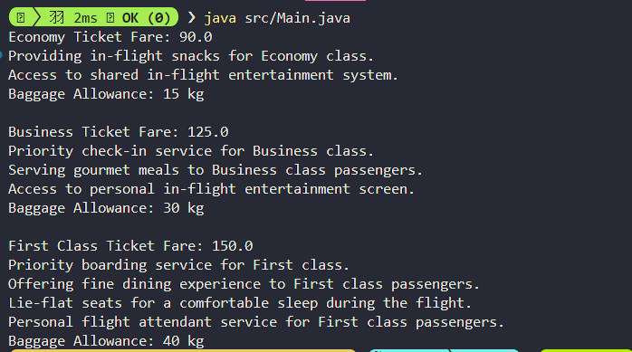

# **Tugas PBO Week 12**

**Nama** : Adyuta Prajahita Murdianto

**NRP** : 5025221186

**Kelas** : PBO A

## **Class Ticket**

```java
public class Ticket {
    private String passengerName;
    private String flightNumber;
    private double baseFare;
    protected int allowedBaggage;

    public Ticket(String passengerName, String flightNumber, double baseFare) {
        this.passengerName = passengerName;
        this.flightNumber = flightNumber;
        this.baseFare = baseFare;
        this.allowedBaggage = 15;
    }

    public double calculateFare() {
        return baseFare;
    }

    public String getPassengerName() {
        return passengerName;
    }

    public String getFlightNumber() {
        return flightNumber;
    }

    public double getBaseFare() {
        return baseFare;
    }

    public int getBaggageAllowance() {
        return allowedBaggage;
    }
}
```

Superclass yang digunakan untuk merepresentasikan tiket pesawat secara umum. Kelas ini berisi atribut dasar yang digunakan oleh semua jenis tiket dan metode yang dapat di-override di subclass untuk memberikan perilaku khusus.

### **Attribute**

**passengerName**

Menyimpan nama penumpang yang memesan tiket.

**flightNumber**

Menyimpan nomor penerbangan yang terkait dengan tiket.

**baseFare**

Menyimpan tarif dasar tiket sebelum penyesuaian tarif berdasarkan kelas penerbangan.

**allowedBaggage**

Menyimpan jumlah maksimal bagasi yang diperbolehkan (dalam kilogram).

### **Method**

**Ticket**

Konstruktor yang digunakan untuk menginisialisasi objek `Ticket` dengan nama penumpang, nomor penerbangan, dan tarif dasar. Atribut `allowedBaggage` diatur ke nilai default 15 kg. Konstruktor ini menyediakan dasar bagi subclass untuk mewarisi atribut dan metode yang relevan.

**calculateFare**

Metode ini mengembalikan tarif dasar tiket. Di subclass, metode ini di-override untuk menghitung tarif yang disesuaikan dengan kebijakan kelas penerbangan (misalnya, diskon atau biaya tambahan).

**getPassengerName**

Mengembalikan nama penumpang yang memesan tiket. Metode ini membantu dalam identifikasi dan pencocokan data pemesanan.

**getFlightNumber**

Mengembalikan nomor penerbangan terkait tiket, memudahkan pengelolaan penerbangan di dalam sistem.

**getBaseFare**

Mengembalikan tarif dasar tiket, yang menjadi acuan perhitungan tarif akhir.

**getBaggageAllowance**

Mengembalikan batas bagasi yang diizinkan. Diimplementasikan dengan nilai default (15 kg) di superclass dan dapat di-override oleh subclass untuk menyesuaikan kebijakan bagasi.

## **Class EconomyTicket**

```java
public class EconomyTicket extends Ticket {
  public EconomyTicket(String passengerName, String flightNumber, double baseFare) {
    super(passengerName, flightNumber, baseFare);
    this.allowedBaggage = 15;
  }

  @Override
  public double calculateFare() {
    return getBaseFare() * 0.9;
  }

  public void provideSnacks() {
    System.out.println("Providing in-flight snacks for Economy class.");
  }

  public void sharedEntertainment() {
    System.out.println("Access to shared in-flight entertainment system.");
  }
}
```

Subclass dari `Ticket` yang merepresentasikan tiket kelas ekonomi. Kelas ini memiliki kebijakan bagasi standar dan menawarkan diskon tarif untuk penumpang. allowedBaggage: Diinisialisasi di kelas ini dengan nilai 15 kg, yang merupakan batas bagasi untuk penumpang kelas ekonomi. Nilai ini mengikuti batasan umum untuk kelas tiket ekonomi.

### **Attribute**

**allowedBaggage**

Diinisialisasi di kelas ini dengan nilai 15 kg, yang merupakan batas bagasi untuk penumpang kelas ekonomi.

### **Method**

**EconomyTicket**

Konstruktor yang memanggil konstruktor superclass `Ticket` untuk menginisialisasi atribut `passengerName`, `flightNumber`, dan `baseFare`. Nilai `allowedBaggage` diatur ke 15 kg.

**calculateFare**

Menghitung tarif akhir dengan diskon 10% dari `baseFare`. Metode ini meng-override metode `calculateFare` di superclass untuk menyesuaikan tarif dengan kebijakan kelas ekonomi.

**provideSnacks**

Menyediakan camilan kepada penumpang selama penerbangan. Ini adalah metode tambahan yang mencerminkan layanan kelas ekonomi, yang menambahkan kenyamanan selama perjalanan.

**sharedEntertainment**

Menyediakan akses ke sistem hiburan umum di pesawat, memungkinkan penumpang menikmati hiburan bersama-sama.

## **Class BusinessTicket**

```java
public class BusinessTicket extends Ticket {
    public BusinessTicket(String passengerName, String flightNumber, double baseFare) {
        super(passengerName, flightNumber, baseFare);
        this.allowedBaggage = 30;
    }

    @Override
    public double calculateFare() {
        return getBaseFare() * 1.25;
    }

    public void priorityCheckIn() {
        System.out.println("Priority check-in service for Business class.");
    }

    public void gourmetMeals() {
        System.out.println("Serving gourmet meals to Business class passengers.");
    }

    public void personalEntertainment() {
        System.out.println("Access to personal in-flight entertainment screen.");
    }
}
```

Subclass dari `Ticket` yang merepresentasikan tiket kelas bisnis. Kelas ini memiliki kebijakan bagasi lebih besar daripada kelas ekonomi dan menawarkan layanan premium.

### **Attribute**

**allowedBaggage**

Diatur dengan nilai 30 kg di kelas ini, yang mencerminkan kebijakan bagasi untuk penumpang kelas bisnis.

### **Method**

**BusinessTicket**

Konstruktor yang memanggil konstruktor superclass Ticket untuk menginisialisasi atribut umum seperti `passengerName`, `flightNumber`, dan `baseFare`. Atribut `allowedBaggage` diatur ke 30 kg.

**calculateFare**

Menghitung tarif akhir dengan menambahkan biaya 25% dari `baseFare`. Metode ini meng-override metode di superclass untuk menyesuaikan tarif dengan layanan yang lebih baik di kelas bisnis.

**priorityCheckIn**

Menyediakan layanan check-in prioritas bagi penumpang, memungkinkan mereka untuk menghindari antrian panjang dan mempercepat proses naik ke pesawat.

**gourmetMeals**

Menyediakan makanan mewah selama penerbangan, memberikan pengalaman kuliner yang lebih baik dibandingkan dengan kelas ekonomi.

**personalEntertainment**

Memberikan akses ke layar hiburan pribadi, meningkatkan kenyamanan dan privasi penumpang.

## **Class FirstClassTicket**

```java
public class FirstClassTicket extends Ticket {
    public FirstClassTicket(String passengerName, String flightNumber, double baseFare) {
        super(passengerName, flightNumber, baseFare);
        this.allowedBaggage = 40;
    }

    @Override
    public double calculateFare() {
        return getBaseFare() * 1.5;
    }

    public void priorityBoarding() {
        System.out.println("Priority boarding service for First class.");
    }

    public void fineDining() {
        System.out.println("Offering fine dining experience to First class passengers.");
    }

    public void lieFlatSeats() {
        System.out.println("Lie-flat seats for a comfortable sleep during the flight.");
    }

    public void personalAttendant() {
        System.out.println("Personal flight attendant service for First class passengers.");
    }
}
```

Subclass dari `Ticket` yang merepresentasikan tiket kelas pertama. Kelas ini menawarkan fasilitas dan layanan paling mewah, serta kebijakan bagasi yang paling besar di antara semua kelas.

### **Attribute**

**allowedBaggage**

Diatur dengan nilai 40 kg, mencerminkan batas bagasi yang lebih besar untuk penumpang first class. Hal ini memberikan keleluasaan maksimum dalam membawa barang bawaan.

### **Method**

**FirstClassTicket**

Konstruktor yang memanggil konstruktor superclass `Ticket` untuk menginisialisasi atribut `passengerName`, `flightNumber`, dan `baseFare`. Atribut allowedBaggage diatur ke 40 kg.

**calculateFare**

Menghitung tarif akhir dengan menambahkan biaya 50% dari `baseFare`. Metode ini meng-override metode di superclass untuk menyesuaikan tarif dengan fasilitas mewah yang ditawarkan.

**priorityBoarding**

Menyediakan layanan boarding prioritas sehingga penumpang first class dapat naik ke pesawat lebih awal dan menghindari antrian.

**fineDining**

Menawarkan pengalaman makan berkualitas tinggi selama penerbangan, dengan menu eksklusif dan layanan restoran.

**lieFlatSeats**

Menyediakan tempat duduk yang dapat diubah menjadi tempat tidur datar, memberikan kenyamanan tidur selama perjalanan.

**personalAttendant**

Memberikan layanan pramugari pribadi untuk memenuhi kebutuhan khusus penumpang, menjamin pelayanan yang lebih personal dan eksklusif.

## **Class Main**

```java
public class Main {
    public static void main(String[] args) {
        Ticket economy = new EconomyTicket("John Doe", "FL123", 100.0);
        Ticket business = new BusinessTicket("Jane Smith", "FL456", 100.0);
        Ticket firstClass = new FirstClassTicket("Emily Johnson", "FL789", 100.0);

        System.out.println("Economy Ticket Fare: " + economy.calculateFare());
        ((EconomyTicket) economy).provideSnacks();
        ((EconomyTicket) economy).sharedEntertainment();
        System.out.println("Baggage Allowance: " + economy.getBaggageAllowance() + " kg");

        System.out.println("\nBusiness Ticket Fare: " + business.calculateFare());
        ((BusinessTicket) business).priorityCheckIn();
        ((BusinessTicket) business).gourmetMeals();
        ((BusinessTicket) business).personalEntertainment();
        System.out.println("Baggage Allowance: " + business.getBaggageAllowance() + " kg");

        System.out.println("\nFirst Class Ticket Fare: " + firstClass.calculateFare());
        ((FirstClassTicket) firstClass).priorityBoarding();
        ((FirstClassTicket) firstClass).fineDining();
        ((FirstClassTicket) firstClass).lieFlatSeats();
        ((FirstClassTicket) firstClass).personalAttendant();
        System.out.println("Baggage Allowance: " + firstClass.getBaggageAllowance() + " kg");
    }
}
```

Merupakan kelas utama untuk menjalankan program. Pada kelas ini, kita akan membuat object untuk masing-masing tingkatan tiket.

## **Hasil**


